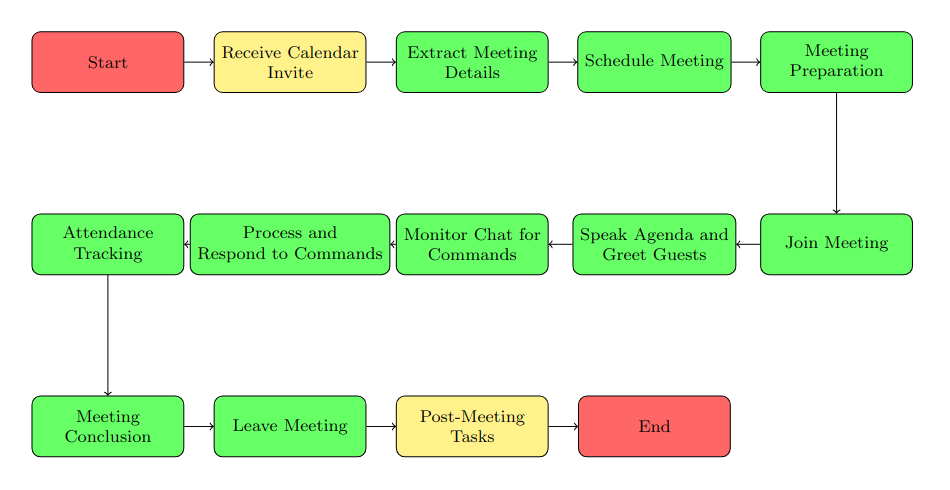

# Project Aurora 🌟

Project Aurora is an AI-powered assistant designed to enhance your Google Meet experience. It joins your meetings, assists with meeting management tasks, and provides real-time assistance to streamline collaboration. Say goodbye to mundane meeting logistics and let Aurora take care of it for you!

Project Aurora is an AI-powered assistant designed to enhance your Google Meet experience. It joins your meetings, assists with meeting management tasks, and provides real-time assistance to streamline collaboration.

With Aurora, you can invite the assistant to your Google Meet meetings through email invitations. Upon joining the meeting, Aurora greets all participants and takes care of various meeting-related tasks. You can issue commands to Aurora, such as \introduce, \summary, \conclude, or \mute, allowing you to easily control the flow of the meeting.

Aurora excels at providing a seamless meeting experience. It can introduce the meeting, speak the agenda, take notes, and summarize discussions, ensuring important points are captured and shared with the participants. Additionally, Aurora is equipped with natural language processing capabilities, enabling it to communicate effectively and respond to basic queries.

Internally, Aurora is built on the ChatGPT API running on a Google Virtual Machine, ensuring powerful AI capabilities and efficient processing. The project aims to integrate the Google Assistant SDK, enhancing Aurora's functionality and expanding its capabilities to answer a wider range of questions.

## Features ✨

- 🤖 Automated Meeting Management: Invite Aurora to your Google Meet meetings through email invitations. It will greet all participants and handle various meeting-related tasks.

- 🗣️ Voice-based Interaction: Control the meeting flow with simple commands. Use `\introduce` to have Aurora introduce the meeting, `\summary` to capture important points, `\conclude` to wrap up the meeting, or `\mute` to control audio.

- 📝 Note Taking and Summarization: Aurora can take notes during the meeting, capturing key discussion points, decisions, and action items. It then provides a concise summary of the meeting, ensuring everyone stays aligned.

- 🤝 Natural Language Processing: With powerful natural language processing capabilities, Aurora can understand and respond to basic queries, allowing for seamless interaction with participants.

## Design 

### Flow Diagram

### System Architecture
The system architecture for Aurora, the Google Meet assistant, can be divided into the following components:

| Component                | Description                                                                                          |
|--------------------------|------------------------------------------------------------------------------------------------------|
| User Interface           | Facilitates user interactions with Aurora, including sending meeting invites and issuing commands.    |
| Scheduler                | Manages meeting scheduling and triggers Aurora's actions at the designated time.                     |
| Google Account Manager   | Handles the dedicated Google account used by Aurora to join meetings.                                 |
| Puppeteer Integration    | Interacts with the Google Meet web application using Puppeteer for automation.                        |
| Text-to-Speech (TTS) Engine  | Converts text-based content into spoken audio for Aurora's communication with meeting participants. |
| Command Processor        | Interprets commands from the host via chat, generates responses, and executes requested actions.      |
| Virtual Microphone Integration | Interfaces with virtual microphone software to simulate Aurora's voice in the meeting.             |

## Getting Started 🚀

To get started with Project Aurora, follow these steps:

1. Clone the repository: `git clone https://github.com/your-username/project-aurora.git`
2. Install dependencies: `npm install`
3. Configure your Google Meet API credentials.
4. Set up the necessary environment variables.
5. Run the application: `node index.js`

Make sure to check out the detailed installation and setup instructions in the [Documentation](docs/setup.md) for a smooth start.

## Contributing 👥

We welcome contributions from the community to improve Project Aurora! To contribute, please follow these steps:

1. Fork the repository.
2. Create a new branch: `git checkout -b feature/your-feature-name`
3. Make your changes and commit them.
4. Push the changes to your forked repository.
5. Open a pull request, describing your changes and the motivation behind them.

Please refer to our [Contributing Guidelines](CONTRIBUTING.md) for more details.

## License 📝

This project is licensed under the [MIT License](LICENSE).

## Contact Us 📧

Have questions or feedback? Feel free to reach out.

---

Let's revolutionize the way we conduct Google Meet meetings with Project Aurora. Together, we can make virtual meetings more productive, engaging, and hassle-free! 🚀
